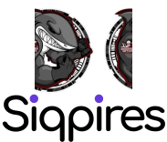

<h3 style="font-size:40px">Olá! Bem-vindo ao meu perfil no Github.</h3>

<strong>Me chamo Bruno! Sou estudante de Engenharia de Software na Universidade de Vassouras.</strong>

<!--  -->

 

<h3><strong>SKILLS</strong>:</h3>
 

 
